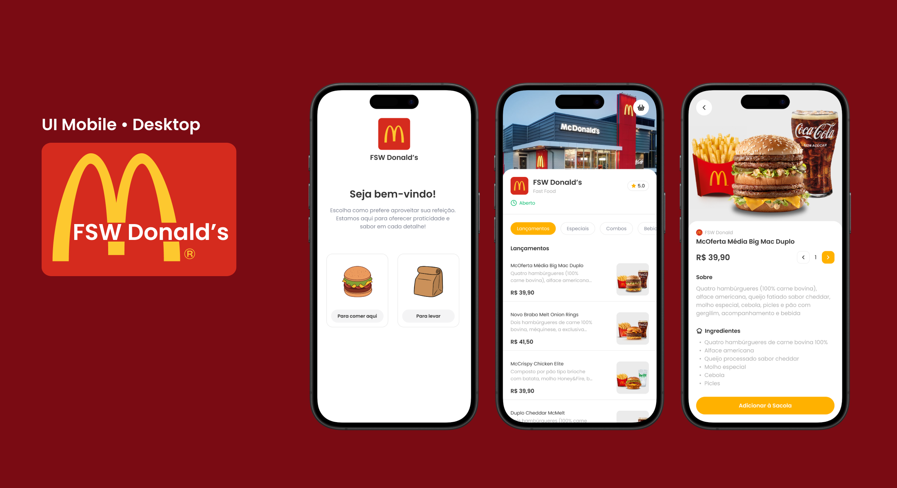

## Sistema de Autoatendimento - FSW (Full Stack Week)
Sistema de autoatendimento inspirado no McDonald's, voltado para dispositivos móveis.

### Tecnologias Utilizadas
Next.js - Framework para React, utilizado para facilitar a criação de aplicações fullstack.
React - Biblioteca para construir interfaces de usuário.
Prisma - ORM (Object Relational Mapping) para manipulação do banco de dados.
TypeScript - Superset do JavaScript, para adicionar tipagem estática.
TailwindCSS - Framework CSS para construção rápida e responsiva de interfaces.
PostgreSQL - Banco de dados relacional utilizado para armazenar as informações do sistema. 

### Funcionalidades
O sistema de autoatendimento oferece as seguintes funcionalidades:

Escolha de consumo: O usuário pode optar por consumir no local ou levar o pedido para viagem.
Seleção de produtos: O usuário pode escolher produtos do cardápio e especificar a quantidade desejada.
Carrinho de compras: O projeto utiliza Context API para gerenciar o carrinho, permitindo ao usuário visualizar e modificar os itens antes de finalizar a compra.
Registro de pedidos: Ao finalizar a compra, um pedido é registrado no banco de dados utilizando o CPF do usuário como identificador.
Visualização de pedidos: O usuário pode visualizar seus pedidos passados por meio do cpf.

